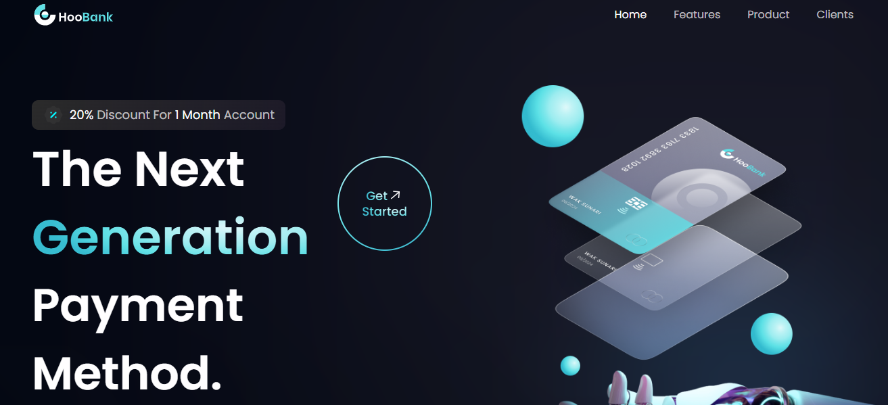
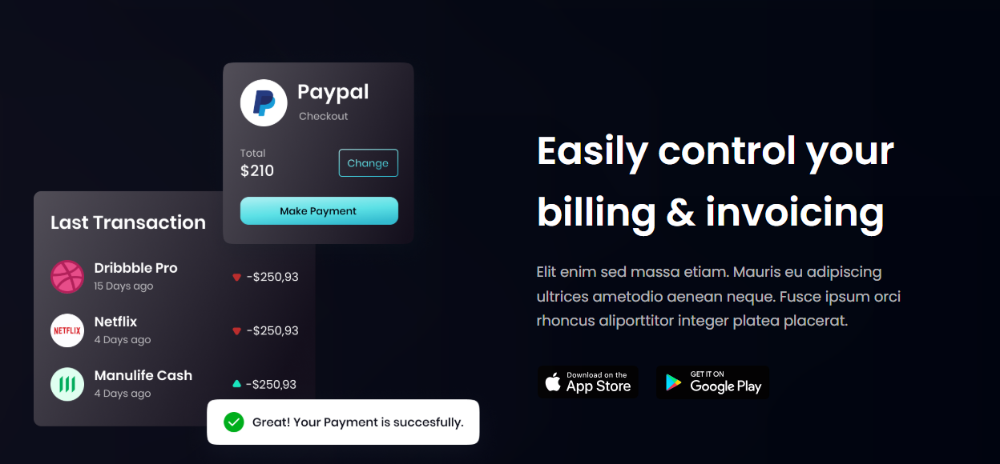
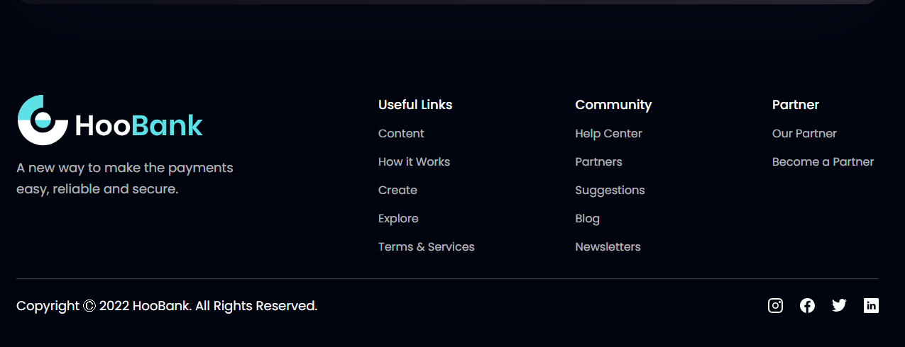

HooBank – Modern Banking Landing Page

HooBank is a modern, fully responsive banking website built with React.js and TailwindCSS, offering a sleek design, smooth navigation, and optimized performance.
This project showcases a professional-grade frontend with reusable components and clean code architecture.

🚀 Features:

-Responsive Design – Works seamlessly on desktop, tablet, and mobile devices.
-Modern UI/UX – Stylish gradients, typography, and smooth animations.
-Reusable Components – Built with a modular React component structure.
-React Router Integration – Separate pages for Terms, Blog, Privacy Policy, etc.
-Light/Dark Mode Toggle – Switch between themes for better accessibility.
-Optimized Build – Developed with Vite for faster development and build times.

🛠️ Technologies Used:

-React.js – Component-based architecture for dynamic UI.
-TailwindCSS – Utility-first styling for fast and responsive design.
-JavaScript (ES6+) – Modern scripting for logic and interactivity.
-Vite – Lightning-fast development and build tool.
-HTML5 & CSS3 – Semantic structure and styling enhancements.

📸 Screenshots:

Install Dependencies
npm install

Start Development Server
npm run dev
